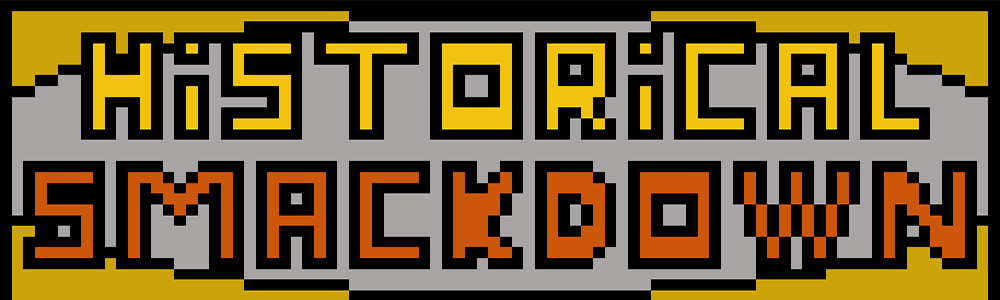

# Historical-Smackdown
Historical Smackdown is a 2D pixel art game where people known from the history fight against each other.

The game is currently in early development stage.

## Gameplay
Historical Smackdown is a simple fighter game where player choose character and try to defeat his opponent. Depending on the game mode player can fight against another player or AI.

## Features

- Story mode: Mode where player has to go through our story and complete all quests
- Varied mechanics and abilities: Every character has different skills, pros and cons
- Lots of fighting characters: Many famous faces you may know from history
- History with a grain of salt: Caricatured historical figures and a little bit of black humor

## Used libraries

* [SFML](http://www.sfml-dev.org/) : Sound and graphics
